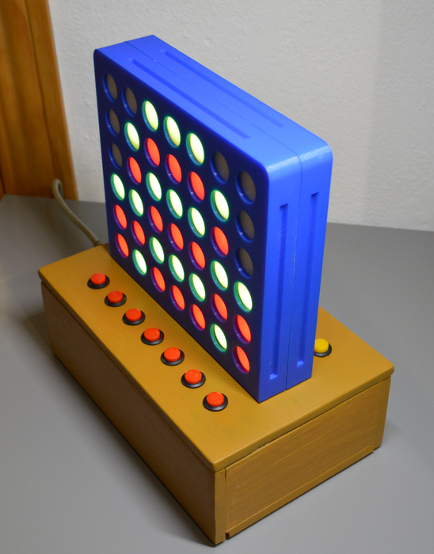

# VERSIÓN ESPAÑOL
¡Hola a todos!

En este repositorio encontrarás el material necesario para realizar nuestro 4 en raya.

  

Los contribuidores en este proyecto son:

**Christian López Reyes**

 [**Juan Pablo Páez Guerrero**](https://github.com/PabloPaez07)

 [**Luis Miguel Campos García**](https://github.com/LuisMiguelCG)

Este repositorio te dará la oportunidad de cambiar el programa de nuestro proyecto como quieras. Sin embargo,
estamos abiertos a conocer tus ideas que aumenten el rendimiento de este código Arduino. Este proyecto es de código abierto y está publicado en este enlace: <https://www.instructables.com/Electronic-Game-Four-in-a-Row>

## IMPORTANTE

Este proyecto cuenta con licencias de 
Creative Commons (BY) (NC - No comercial) (SA)

# ENGLISH VERSION
¡Hello everyone!

In this repository, you will find the materials needed to play our 4 in a row.

  

The contributors to this project are:

**Christian López Reyes**

 [**Juan Pablo Páez Guerrero**](https://github.com/PabloPaez07)

 [**Luis Miguel Campos García**](https://github.com/LuisMiguelCG)

This repository will bring you the oportunity of change the program of our project, like you want. However, we
are open to know about your ideas that it will increase the performance of this Arduino code. This project is openSource and it's publicated on this link: <https://www.instructables.com/Electronic-Game-Four-in-a-Row>

## IMPORTANT

This project has lincenses of 
Creative Commons (BY)(NC - No comercial)(SA)
